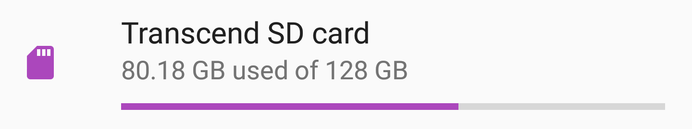

+++
Title = "Recovering data from a failing Android adoptable storage"
date = "2019-03-27"
Tags = ["android", "forensics", "recovery", "storage", "decryption"]
+++

## Background

My phone running Android stopped being able to read its [Adoptable Storage](https://source.android.com/devices/storage/adoptable)&trade; and so lost all non-stock apps and their data (Riot, OSMand+, Signal, etc) as well as the shared "home dir" containing DCIM, Documents, Downloads. Most of this is backed up in various ways but I'd like to get the whole storage back.

The phone is rooted, using the LineageOS method with ADB root access enabled, so I can copy the encryption keys with a USB cable.

Solid state memory devices are sensitive to power supply issues, and I've long suspected my phone's power supply is flakey since I often see spontaneous reboots and assorted random failures. My hope is that the card will be readable by a device with better power (it was!)

## Plan

 1. Image the card
 2. Get the key from the phone using ADB
 3. Decrypt
 4. Copy image to a new encrypted card

**Note:** 1 and 4 can be completed without 2 and 3, although resizing the partition to the new card size wouldn't be possible.

## Image the failing memory card

I removed the SD card from the phone and inserted it into my Linux laptop's SD port.

First rule of storage device recovery: create an image and work on the image.

**Note:** I'm creating an image of the *entire device rather than just the encrypted partition*. This will allow me to restore to a new card later.

<details>

<summary>First attempted imaging with `dd`, but saw I/O errors.</summary>

### Attempt with `dd`

```
~/backups/herolte_recovery   
❯ sudo dd if=/dev/mmcblk0 of=herolte_sd_recovery_fulldisk.img status=progress
19326185+0 records in
19326184+0 records out
9895006208 bytes (9.9 GB, 9.2 GiB) copied, 208.766 s, 47.4 MB/s
dd: error reading '/dev/mmcblk0': Input/output error
```

Indeed,

```
❯ journalctl -b --since "10 minutes ago"
Mar 24 13:13:52 chip kernel: print_req_error: I/O error, dev mmcblk0, sector 19359824 flags 80700
Mar 24 13:13:52 chip kernel: print_req_error: I/O error, dev mmcblk0, sector 19359871 flags 80700
<30 lines omitted>
Mar 24 13:15:23 chip kernel: print_req_error: I/O error, dev mmcblk0, sector 22323535 flags 0
Mar 24 13:15:23 chip kernel: Buffer I/O error on dev mmcblk0, logical block 22323535, async page read
```
</details>

### ddrescue

Time to try [ddrescue](https://www.gnu.org/software/ddrescue/ddrescue.html), a time-tested utility for reading data from dying block devices. ([archwiki](https://wiki.archlinux.org/index.php/disk_cloning#Using_ddrescue))


```
❯ sudo ddrescue -f -n /dev/mmcblk0 herolte_sd_recovery_fulldisk.img herolte_sd_recovery_fulldisk.log
GNU ddrescue 1.23
Press Ctrl-C to interrupt
     ipos:   31673 MB, non-trimmed:        0 B,  current rate:   9092 kB/s
     opos:   31673 MB, non-scraped:        0 B,  average rate:  32025 kB/s
non-tried:        0 B,  bad-sector:        0 B,    error rate:       0 B/s
  rescued:   31673 MB,   bad areas:        0,        run time:     16m 28s
pct rescued:  100.00%, read errors:        0,  remaining time:         n/a
                              time since last successful read:         n/a
Finished                                     
```

That went considerably better, no IO errors at all. Why the difference from `dd`? `ddrescue` is optimized in various ways to deal with unreliable block devices.

## Fetch key from phone

[@kapitanpetko](https://twitter.com/kapitanpetko)'s [post](https://nelenkov.blogspot.com/2015/06/decrypting-android-m-adopted-storage.html) from 2015 is the original source all the related stack exchange articles seem to draw from (usually without reference).

Allow reading naughty bits (requires phone rooted for adb access):

```
❯ adb root       
* daemon not running; starting now at tcp:5037
* daemon started successfully
restarting adbd as root
```

Fetch the key:

```
❯ adb pull /data/misc/vold
/data/misc/vold/: 1 file pulled. 0.0 MB/s (16 bytes in 0.013s)
❯ ls vold
bench  expand_ffffffffffffffffffffffffffffffff.key
# convert bin to hex
❯ hexdump -e '16/1 "%02x" "\n"' vold/expand_ffffffffffffffffffffffffffffffff.key
aaaaaaaaaaaaaaaaaaaaaaaaaaaaaaaa%         
```

([source](https://stackoverflow.com/a/15554717/114581) for plain hexdump format string)

## Mount encrypted image


First [map the image to a loop device](https://unix.stackexchange.com/questions/358779/unlock-android-encrypted-disk-image-file-of-sd-card-on-desktop-linux) so dmsetup can use it. Note that the `-P` flag creates a device for each partition in the image.

```
❯ sudo losetup --show --find -P herolte_sd_recovery_fulldisk.img 
/dev/loop0
```


[Map the encrypted device](https://android.stackexchange.com/questions/145443/how-to-decrypt-adopted-storage):

```❯ sudo su
chip# dmsetup create crypt1 --table "0 `blockdev --getsize /dev/loop0p2` crypt aes-cbc-essiv:sha256 aaaaaaaaaaaaaaaaaaaaaaaaaaaaaaaa 0 /dev/loop0p2 0"
```

Mount filesystem:

```
❯ mkdir mnt
❯ sudo mount /dev/mapper/crypt1 mnt
❯ ls mnt 
app  local  lost+found  media  misc  user  user_de
```

Looks good!

## Copy to new card

 1. Image the physical block device (not just the encrypted partition) and write that to a new card, and hope Android doesn't distinguish between physical media. This also depends on the new media being at least as large as the old one.
 2. Use the phone to initialize a new card, mount it on the laptop and copy files over


<details>
<summary>**Side note:** Option 2 was a dead end because Android didn't see any of the apps.</summary>

## Attempt to copy files to new encrypted partition

The 32GB replacement cards I ordered are actually physically smaller (28.5G vs 29.5G) than the original so I wouldn't be able to restore a full device image to one of them. I have a 64G card that I could copy to the image to but that would likely result in half the card being unused, so I opted to try copying the data to a new encrypted partion.

 1. Insert the new 32G card in phone and format as encrypted.
 2. Get key as above.
 3. Mount the card as above, but skipping the losetup step and using mmcblk0p2 instead of loop0.
 4. With both the loop0 image mounted and the new card's physical partition, remove contents of new partition and copy data over with `rsync -a srcmnt/ destmnt`.

Unfortunately as noted above, android doesn't recognized apps copied over this way.
</details>


## Copy full device image

Plan:

 1. Image the entire card rather than just the encrypted partition.
 2. `dd` the image to new card.
 3. Grow the encrypted partition, since the new card is 64G while the old was 32G.

Ok, now what I'd like to do is copy the entire filesystem to a new card. My new card is 2x the size of the old card, so I'll grow the partition after copying. If your card is smaller you'll need to shrink the partition before copying.

```
❯ sudo dd of=/dev/mmcblk0 if=herolte_sd_recovery_fulldisk.img bs=4M status=progress
[sudo] password for eric: 
7555+1 records in
7555+1 records out
31691112448 bytes (32 GB, 30 GiB) copied, 729.118 s, 43.5 MB/s
```

At this point I ran `sync` and put the card back in the phone. It works!

The only problem is, because I copied a 32G image to a 64G card, only half the available space is usable.

## Resizing the encrypted partition

Normally growing a partition is a two step process:

 1. Grow the partition
 2. Grow the contained FS

(for shrinking you reverse the steps)

This turns out to work mostly the same for an encrypted partition.

### Resize partition

```
❯ sudo parted /dev/mmcblk0
GNU Parted 3.2
Using /dev/mmcblk0
Welcome to GNU Parted! Type 'help' to view a list of commands.
(parted) pr                                                               
Warning: Not all of the space available to /dev/mmcblk0 appears to be used, you can fix the GPT to use all
of the space (an extra 63145984 blocks) or continue with the current setting? 
Fix/Ignore? fix                                                           
Model: SD GC2QT (sd/mmc)
Disk /dev/mmcblk0: 64.0GB
Sector size (logical/physical): 512B/512B
Partition Table: gpt
Disk Flags: 

Number  Start   End     Size    File system  Name            Flags
 1      1049kB  17.8MB  16.8MB  fat32        android_meta
 2      17.8MB  31.7GB  31.7GB               android_expand

(parted) resizepart 2 100%
(parted) pr

Number  Start   End     Size    File system  Name            Flags
 1      1049kB  17.8MB  16.8MB  fat32        android_meta
 2      17.8MB  64.0GB  64.0GB               android_expand

(parted) q                                                                
Information: You may need to update /etc/fstab.
```

### Resize filesystem

First map the encrypted partition using the new size:

```
dmsetup create crypt6 --table "0 `blockdev --getsize /dev/mmcblk0p2` crypt aes-cbc-essiv:sha256 aaaaaaaaaaaaaaaaaaaaaaaaaaaaaaaa 0 /dev/mmcblk0p2 0"
```

Now resize the filesystem:

```
❯ sudo resize2fs /dev/mapper/crypt6
resize2fs 1.45.0 (6-Mar-2019)
Please run 'e2fsck -f /dev/mapper/crypt6' first.

❯ sudo e2fsck -f /dev/mapper/crypt6
e2fsck 1.45.0 (6-Mar-2019)
Pass 1: Checking inodes, blocks, and sizes
Pass 1E: Optimizing extent trees
Pass 2: Checking directory structure
Pass 3: Checking directory connectivity
Pass 4: Checking reference counts
Pass 5: Checking group summary information

/dev/mapper/crypt6: ***** FILE SYSTEM WAS MODIFIED *****
/dev/mapper/crypt6: 47391/1933312 files (1.0% non-contiguous), 3824859/7732731 blocks

❯ sudo resize2fs /dev/mapper/crypt6             
resize2fs 1.45.0 (6-Mar-2019)
Resizing the filesystem on /dev/mapper/crypt6 to 15625979 (4k) blocks.
The filesystem on /dev/mapper/crypt6 is now 15625979 (4k) blocks long.
```

## Wrapping up

```
❯ sudo dmsetup remove crypt6
❯ sync
```

Your new card should now show full capacity in android. 

### Quirks

For some reason in my case Android shows a fictitious extra 64G of used space and capacity, maybe because it's confused by the device having different metadata.



